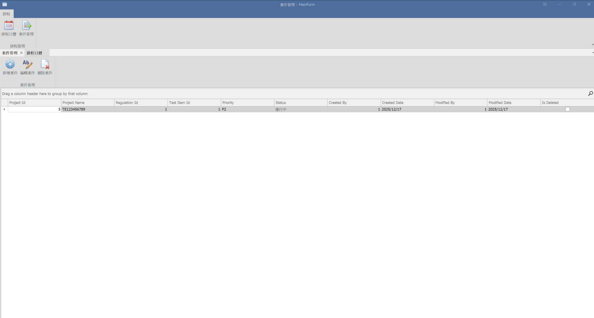

Step 1 — 先把 MainForm 設成「MDI Container」

打開 MainForm

在屬性視窗找到：

IsMdiContainer = True

讓 MainForm 可以像 ERP 一樣同時開多個子視窗。

完成後，MainForm 中間會變成灰色區域，就是 MDI Panel。

-----------------------------------------------

🔹 AllowMinimizeRibbon

控制使用者是否能把 Ribbon 收起來。

True → 可折疊

False → 不能折疊（固定展開）

用途：避免 UI 因為被使用者不小心折起造成誤會。

-----------------------------------------------

🔹 RibbonStyle

設定 Ribbon 的外觀風格（像套用主題）。

常用：

OfficeUniversal → 現代扁平風

Office2019 → 微軟 Office 風格

用途：讓你的系統 UI 看起來統一化、專業化。

-----------------------------------------------

🔹 ShowExpandCollapseButton

決定是否顯示右上角「折疊/展開」箭頭。

True → 顯示按鈕

False → 隱藏按鈕

用途：如果你不想讓使用者亂折疊 Ribbon，就把它關掉。

🔹 1️⃣ 關掉 Application Button（左上角）
ShowApplicationButton = False

🔹 2️⃣ 關掉頁籤列（你已經做過，但再確認）
ShowPageHeaders = False

🔹 3️⃣ 關掉「最上層藍色 Header（重點）」

👉 這個是關鍵屬性：

RibbonStyle = Office2019

或（如果你現在是 Office2007 / 2010）：

RibbonStyle = Office2013

⚠️ 不要用 Office2007
那個一定會有藍色 Caption。

🔹 4️⃣ 關掉展開 / 收合箭頭（右邊那個 ˄）
ShowExpandCollapseButton = False
AllowMinimizeRibbon = False

🔹 5️⃣（保險）關掉工具列殘留
ToolbarLocation = Hidden
ShowToolbarCustomizeItem = False

-----------------------------------------------

✅ 正解（官方、穩、一次到位）
✔ 正確結構一定要長這樣
ProjectPage (XtraUserControl)
 └─ panelMain (Dock = Fill)   ⭐⭐ 關鍵
     ├─ ribbonControl1 (Dock = Top)
     └─ panelContent   (Dock = Fill)
         └─ gridControl (Dock = Fill)

👉 一定要多這一層「外層容器」

不是多此一舉，是 DevExpress 要求。

🛠 請你照做（5 分鐘一定好）
Step 1️⃣ 新增一個「最外層 PanelControl」

在 ProjectPage：

Toolbox → PanelControl

拖到 ProjectPage

設定：

Name = panelMain
Dock = Fill

Step 2️⃣ 把「所有東西」丟進 panelMain

請照順序做（很重要）：

把 ribbonControl1 拖進 panelMain

把 panelContent 也拖進 panelMain

最後結構一定要是：

panelMain
 ├─ ribbonControl1
 └─ panelContent

Step 3️⃣ 設定 Dock（這次會真的有用）
ribbonControl1
Dock = Top

panelContent
Dock = Fill

gridControl
Dock = Fill

⚠️ 不要用 Anchor
⚠️ 不要再多加 panel

-----------------------------------------------

資料唯獨

🥇 做法一（最推薦，99% 專案都用這個）
👉 設定 gridView1.OptionsBehavior.ReadOnly = true
在 Designer（設計器） 做：

點選 gridView1（不是 gridControl）

屬性視窗找到：

OptionsBehavior

設定：

ReadOnly = True

✅ 完成後效果：

所有儲存格都不能編輯

但排序 / 選取 / 捲動都還在

🥈 必補設定（強烈建議一起做）

DevExpress 有時會「看起來唯讀，但其實還能加刪列」，所以補這三個。

👉 同樣在 gridView1 設定
OptionsBehavior.AllowAddRows = False
OptionsBehavior.AllowDeleteRows = False
OptionsBehavior.Editable = False

-----------------------------------------------

👉 設定 ShowGroupPanel = false
在 Designer（設計器）

點選 gridView1

找到屬性：

OptionsView

設定：

ShowGroupPanel = False

關閉Drag a column header那串文字

-----------------------------------------------